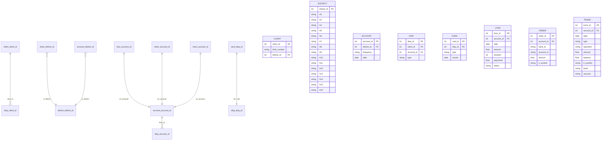

```mermaid
erDiagram

    client_client_id ||--o{ disp_client_id : links_to
    client_district_id }o--|| district_district_id : in_district
    account_account_id ||--o{ disp_account_id : links_to
    account_district_id }o--|| district_district_id : in_district
    loan_account_id ||--|| account_account_id : on_account
    order_account_id ||--|| account_account_id : on_account
    trans_account_id ||--|| account_account_id : on_account
    card_disp_id ||--|| disp_disp_id : for_role


    CLIENT {
        int client_id PK
        string birth_number
        int district_id FK
    }

    DISTRICT {
        int district_id PK
        string A2
        string A3
        string A4
        string A5
        string A6
        string A7
        string A8
        string A9
        string A10
        string A11
        string A12
        string A13
        string A14
        string A15
        string A16
    }

    ACCOUNT {
        int account_id PK
        int district_id FK
        string frequency
        date date
    }

    DISP {
        int disp_id PK
        int client_id FK
        int account_id FK
        string type
    }

    CARD {
        int card_id PK
        int disp_id FK
        string type
        date issued
    }

    LOAN {
        int loan_id PK
        int account_id FK
        date date
        float amount
        int duration
        float payments
        string status
    }

    ORDER {
        int order_id PK
        int account_id FK
        string bank_to
        string account_to
        float amount
        string k_symbol
    }

    TRANS {
        int trans_id PK
        int account_id FK
        date date
        string type
        string operation
        float amount
        float balance
        string k_symbol
        string bank
        string account
    }
```
