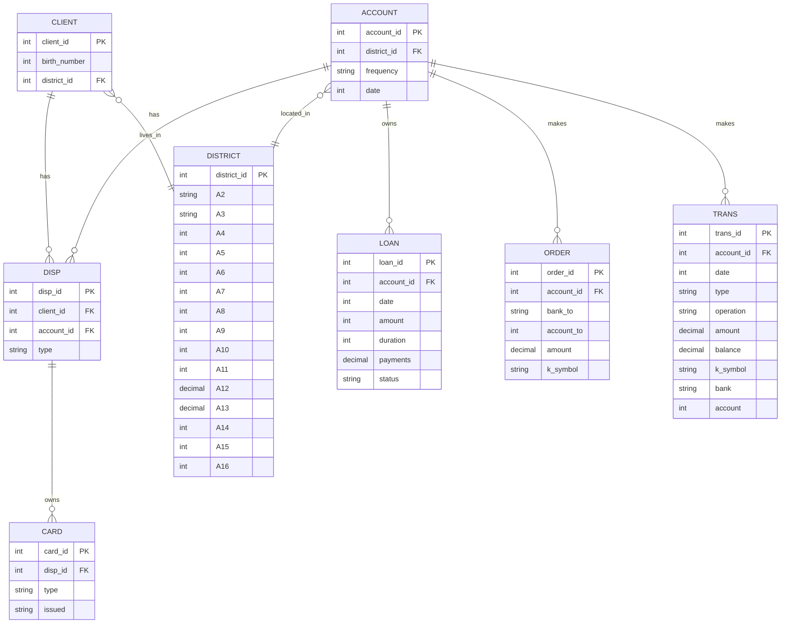

# 📊 Структура базы данных проекта Czech Bank

## Описание таблиц

- **account.csv** — информация о банковских счетах клиентов.
- **card.csv** — данные о банковских картах, привязанных к счетам.
- **client.csv** — данные о клиентах банка.
- **disp.csv** — связь клиентов со счетами (disposition).
- **district.csv** — информация о районах.
- **loan.csv** — информация по кредитам.
- **order.csv** — платёжные поручения.
- **trans.csv** — транзакции по счетам.

---

## Data Dictionary

### account.csv

| Column      | Тип данных | Описание                                               |
|-------------|------------|--------------------------------------------------------|
| account_id  | int        | Уникальный идентификатор счёта                         |
| district_id | int        | Идентификатор района, где открыт счёт (FK к district) |
| frequency   | string     | Частота активности по счёту (напр., monthly, quarterly)|
| date        | date       | Дата открытия счёта                                    |

### card.csv

| Column    | Тип данных | Описание                                              |
|-----------|------------|-------------------------------------------------------|
| card_id   | int        | Уникальный идентификатор карты                        |
| disp_id   | int        | Идентификатор владельца карты (FK к disp)             |
| type      | string     | Тип карты (напр., debit, credit)                      |
| issued    | date       | Дата выдачи карты                                     |

### client.csv

| Column       | Тип данных | Описание                                        |
|--------------|------------|-------------------------------------------------|
| client_id    | int        | Уникальный идентификатор клиента                 |
| birth_number | string     | Персональный идентификатор, содержащий дату рождения|
| district_id  | int        | Идентификатор района проживания (FK к district) |

### disp.csv

| Column     | Тип данных | Описание                                           |
|------------|------------|----------------------------------------------------|
| disp_id    | int        | Уникальный идентификатор связи клиента и счёта     |
| client_id  | int        | Идентификатор клиента (FK к client)                 |
| account_id | int        | Идентификатор счёта (FK к account)                  |
| type       | string     | Тип владельца счёта (например, owner, authorized)  |

### district.csv

| Column     | Тип данных | Описание                                 |
|------------|------------|------------------------------------------|
| district_id| int        | Уникальный идентификатор района          |
| A2 – A16   | string     | Кодовые обозначения и характеристики района|

### loan.csv

| Column    | Тип данных | Описание                                    |
|-----------|------------|---------------------------------------------|
| loan_id   | int        | Уникальный идентификатор кредита             |
| account_id| int        | Идентификатор счёта, по которому выдан кредит (FK к account) |
| date      | date       | Дата выдачи кредита                         |
| amount    | float      | Сумма кредита                               |
| duration  | int        | Срок кредита (месяцы)                       |
| payments  | float      | Размер ежемесячных платежей                 |
| status    | string     | Статус кредита (напр., active, closed)     |

### order.csv

| Column     | Тип данных | Описание                                     |
|------------|------------|----------------------------------------------|
| order_id   | int        | Уникальный идентификатор платёжного поручения|
| account_id | int        | Идентификатор счёта, с которого идёт платеж (FK к account)|
| bank_to    | string     | Банк получателя                              |
| account_to | string     | Счёт получателя                             |
| amount     | float      | Сумма платежа                               |
| k_symbol   | string     | Символ назначения платежа                    |

### trans.csv

| Column    | Тип данных | Описание                                     |
|-----------|------------|----------------------------------------------|
| trans_id  | int        | Уникальный идентификатор транзакции          |
| account_id| int        | Идентификатор счёта, по которому сделана транзакция (FK к account)|
| date      | date       | Дата транзакции                              |
| type      | string     | Тип транзакции (напр., credit, debit)       |
| operation | string     | Операция (напр., withdrawal, deposit)       |
| amount    | float      | Сумма транзакции                            |
| balance   | float      | Баланс после транзакции                      |
| k_symbol  | string     | Символ назначения                            |
| bank      | string     | Банк контрагента                             |
| account   | string     | Счёт контрагента                             |

---

# 🔗 Внешние ключи и связи между таблицами

| Таблица.Поле (FK)       | ↔ Таблица.Поле (PK)         | Тип связи           | Описание                                  |
|-------------------------|-----------------------------|---------------------|-------------------------------------------|
| `client.district_id`    | `district.district_id`      | многие-к-одному     | Клиент относится к одному району          |
| `account.district_id`   | `district.district_id`      | многие-к-одному     | Счёт зарегистрирован в одном районе       |
| `disp.client_id`        | `client.client_id`          | многие-к-одному     | Пользователь счёта                        |
| `disp.account_id`       | `account.account_id`        | многие-к-одному     | Привязка клиента к счёту                  |
| `card.disp_id`          | `disp.disp_id`              | один-к-одному/многим| Карта выдана держателю счёта              |
| `loan.account_id`       | `account.account_id`        | многие-к-одному     | Кредит привязан к счёту                   |
| `order.account_id`      | `account.account_id`        | многие-к-одному     | Платёжное поручение с конкретного счёта   |
| `trans.account_id`      | `account.account_id`        | многие-к-одному     | Транзакции по счёту                       |

