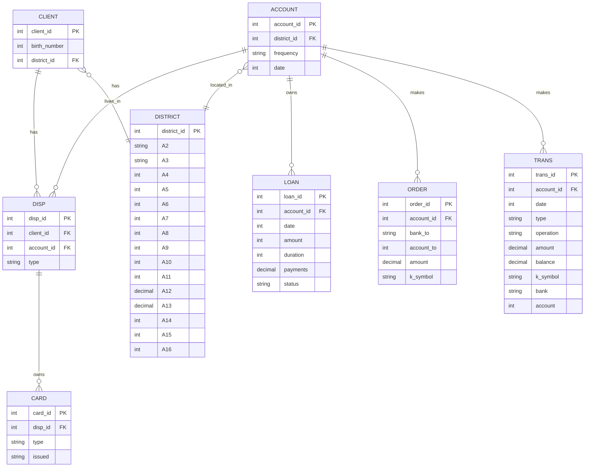

# <div align = 'center'> Czech Bank Project  </div>

Здесь я привожу подробную реализацию проекта по работе клиентов банка. Увидеть другие мои проекты можно в [моем портфолио](https://github.com/marashot96/portfolio/blob/main/README.md).

## 📌 Описание
Анализ банковской активности клиентов на основе открытого датасета Czech Bank. Исследуются транзакции, кредиты, поведение клиентов и потенциальные риски.

## 🎯 Цели проекта
- Провести разведочный анализ данных (EDA)
- Построить профили клиентов и сегментацию
- Оценить риски по займам
- Найти закономерности между транзакциями и дефолтами

## 🧰 Используемые технологии
- Python (Pandas, NumPy, Seaborn, Matplotlib)
- SQL (PostgreSQL)
- Jupyter Notebook

## 📁 Структура проекта
```bash
Credit-Products-Analysis/
│
├── data/                        # Файлы с данными и описанием
│   ├── bank.csv
│   └── README_data.md
│
├── notebooks/                   # Jupyter-блокноты
│   ├── 01_EDA.ipynb             # Исследовательский анализ данных
│   ├── 02_Segmentation.ipynb    # Сегментация клиентов
│   ├── 03_Default_Predict.ipynb # Модель предсказания дефолта
│   └── 04_Report.ipynb          # Итоговая визуализация и выводы
│
├── sql/                         # SQL-запросы для анализа
│   ├── basic_insights.sql
│   └── loan_analysis.sql
│
└── README.md                    # Описание проекта
```

## 📁 Структура данных
Ниже приведена схема используемых в проекте csv-таблиц. Для более подробного изучения структуры таблиц можете перейти по этой ссылке - там приведено подробное их описание: [структура таблиц](https://github.com/marashot96/custs-behavioral-analysis/blob/main/DATABASE_STRUCTURE.md)



## 🔍 Источник данных
UCI Machine Learning Repository – [Bank Marketing](https://archive.ics.uci.edu/ml/datasets/Czech+Bank)

## 🚀 Быстрый старт
1. Склонируйте репозиторий
2. Установите зависимости `pip install -r requirements.txt`
3. Запустите Jupyter Notebook в `notebooks/`


---

## 💼 Контактная информация
Если вы хотите обсудить различные задачи, запросы или проекты, предложить кейс или сотрудничество — обязательно напишите мне!

- 📫 [t.me/marashot96](https://t.me/marashot96)
- 🌐 [marashot96@ya.ru](mailto:marashot96@ya.ru)

<div align="center">  <a href="https://github.com/marashot96/portfolio/blob/main/README.md#--маргарян-ашот---портфолио-"> Обо мне </a> </div>
